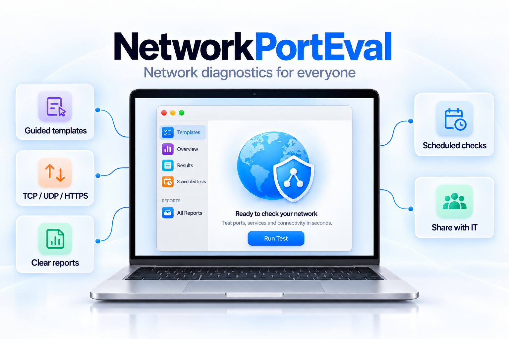
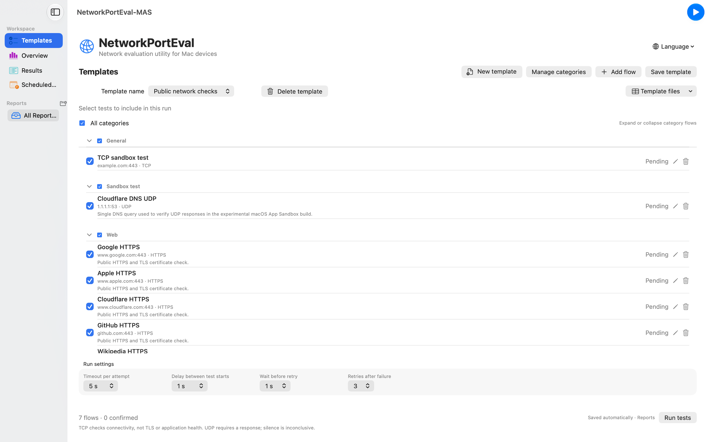
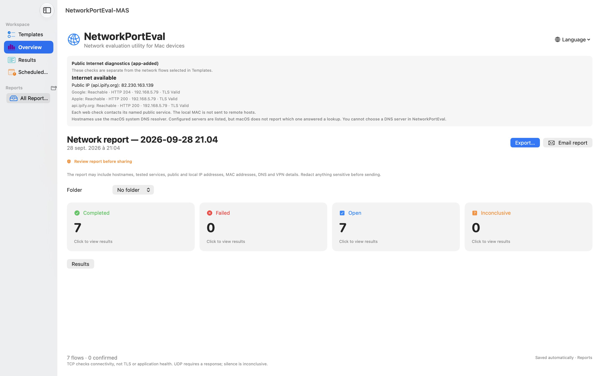
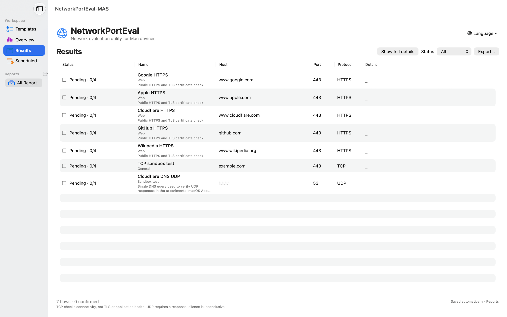
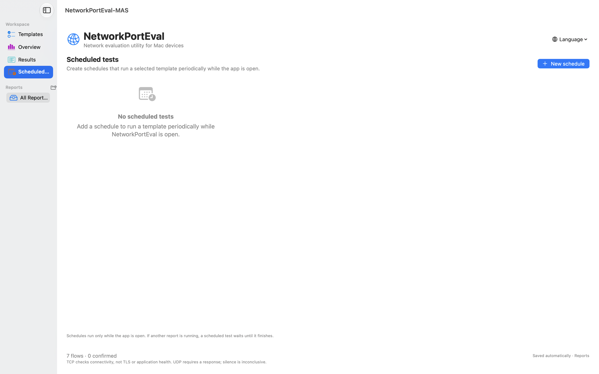
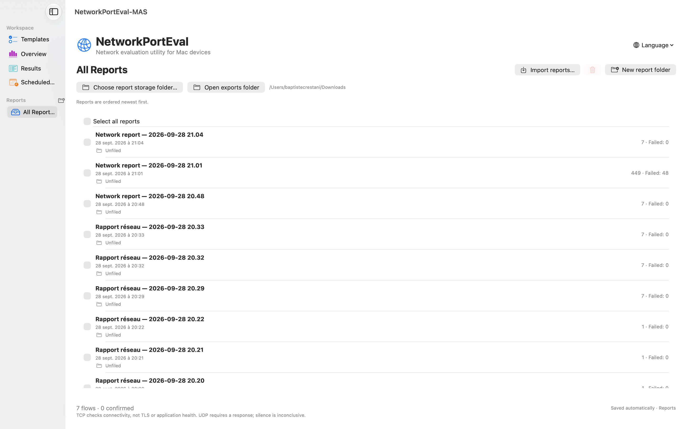
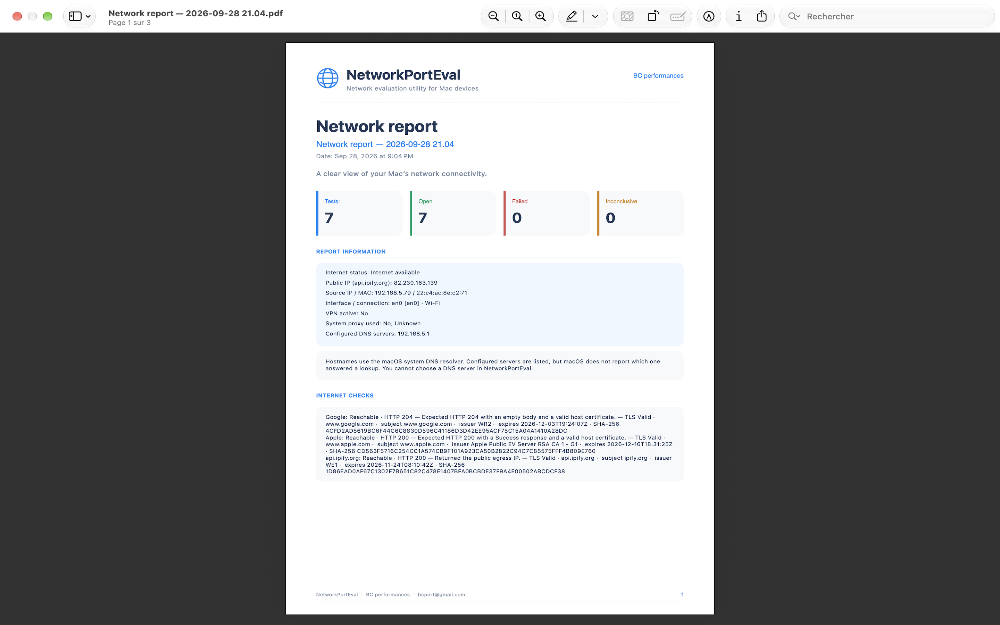

# NetworkPortEval

**See what your Mac can reach. Understand why. Share a clear report.**

NetworkPortEval is a macOS network diagnostics utility for everyone: an IT team can prepare a ready-to-run test template for a colleague, while support teams and network specialists can build and investigate their own test plans. Run the checks you are authorized to perform, then return a clear report to your IT team by email.

[Download the notarized macOS build](https://github.com/Bat73300/NetworkPortEval/releases/tag/v0.1.0-test.5) · [Privacy policy](https://bat73300.github.io/NetworkPortEval/privacy/) · [Quick user guide](docs/USER-GUIDE.md) · [Beginner PDF guide](output/pdf/NetworkPortEval-Quick-User-Guide.pdf) · [User guides](docs/user/) · [Endpoint catalogs](docs/ENDPOINT-CATALOG.md)

### Recognize the app on your Mac

After installation, look for this NetworkPortEval icon in **Applications**, Launchpad or the Dock:

  

> **Current release:** `v0.1.0-test.5` · macOS 26 or later · Developer ID signed and Apple notarized. The Mac App Store build `1.0 (4)` is currently under Apple review.

## Why NetworkPortEval

- **Simple for anyone to run.** Open the template prepared by your IT team, review the selected destinations and click Run. No networking expertise is required.
- **Powerful when you need it.** Build reusable templates and investigate TCP connectivity, UDP responses and HTTPS certificate/hostname validation.
- **Make results useful.** Reports include status, timing, DNS and connection context, TLS details and retry attempts.
- **Track changes over time.** Save reports locally, organize them into folders, schedule recurring checks while the app is open, and export CSV, TXT, PDF or JSON.
- **Share carefully.** Review warnings help you redact hostnames, IP addresses, MAC addresses, DNS and VPN details before sending a report.

## A quick tour

### Templates

IT teams can prepare focused test templates for colleagues, while specialists can build their own from built-in examples or CSV flows. Imported flows start unchecked so the test scope is always explicit.

### Overview

See app-added Internet diagnostics separately from the destinations selected in your template, with the network context needed to interpret the report.

### Results

Use the compact results table for a fast scan, or reveal the full connection, TLS and source details when you need them.

### Scheduled tests and reports

Schedules run only while NetworkPortEval is open. Reports remain on your Mac and can be organized, exported or shared through a user-reviewed email draft.

### PDF export

Generate a branded, multi-page report for handoff or troubleshooting. Saved reports are local and are not encrypted by the app.

## Install

1. Download `NetworkPortEval-DeveloperID-notarized.zip` from the [latest test release](https://github.com/Bat73300/NetworkPortEval/releases/tag/v0.1.0-test.5).
2. Optionally verify the SHA-256 file included in the release.
3. Unzip the archive and move `NetworkPortEval.app` to **Applications**.
4. Open the app and review the selected flows before running a test.

## Use it safely

Only test destinations you are authorized to assess. TCP open means a connection was established; it does not prove application health. UDP silence is inconclusive. HTTPS checks use macOS system trust and the requested hostname. Optional Google, Apple and api.ipify.org diagnostics contact public services and can be skipped for manual runs or disabled per schedule.

## Privacy and data

NetworkPortEval has no account, advertising, analytics or telemetry. Settings, templates, contacts and reports are stored locally. Reports can contain sensitive network metadata, so review and redact them before sharing.

Read the full [privacy policy](https://bat73300.github.io/NetworkPortEval/privacy/) and the [testing guide](TESTING.md).

## Open source

NetworkPortEval is released under the [MIT License](LICENSE). Copyright © 2026 BC performances.
